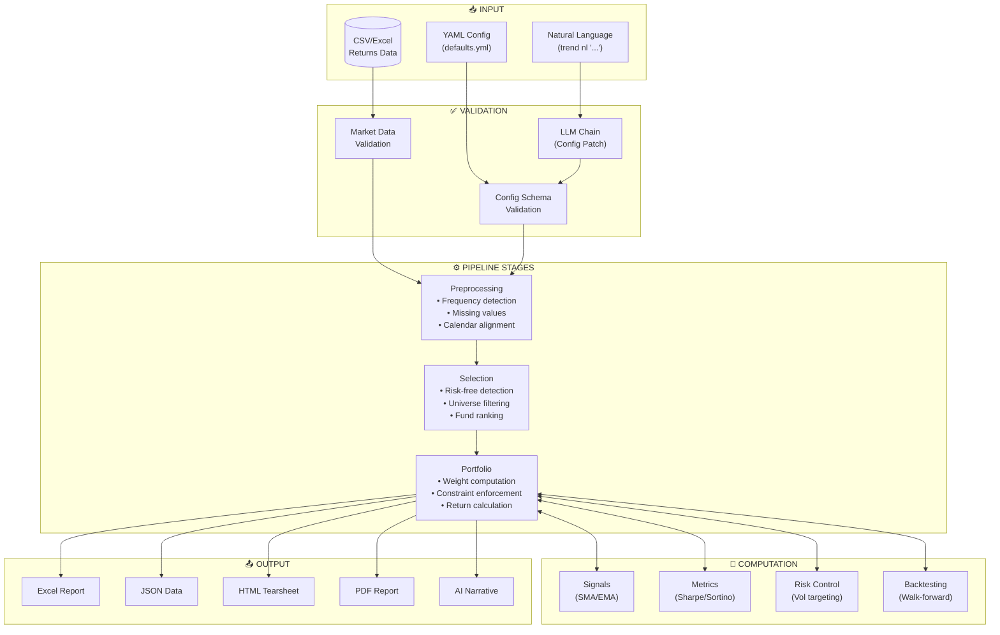
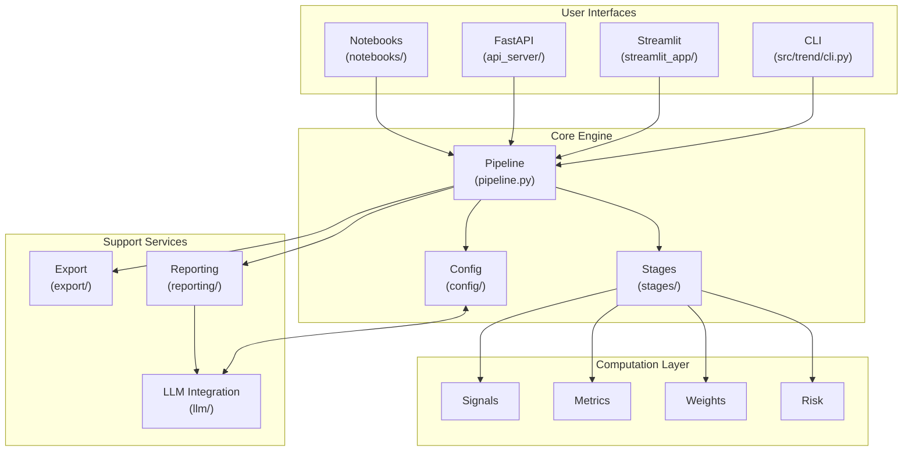

# System Architecture Diagram

This document provides a comprehensive visual representation of the Trend Model Project architecture.

## High-Level Architecture

```
┌──────────────────────────────────────────────────────────────────────────────┐
│                              USER INTERFACES                                  │
├───────────────────┬───────────────────┬───────────────────┬──────────────────┤
│     CLI           │   Streamlit UI    │    REST API       │    Notebooks     │
│  (trend run)      │  (streamlit_app/) │  (FastAPI:8000)   │   (notebooks/)   │
│                   │   (port 8501)     │                   │                  │
└────────┬──────────┴────────┬──────────┴────────┬──────────┴────────┬─────────┘
         │                   │                   │                   │
         └───────────────────┴───────────────────┴───────────────────┘
                                      │
                                      ▼
┌──────────────────────────────────────────────────────────────────────────────┐
│                           CONFIGURATION LAYER                                 │
├──────────────────────────────────────────────────────────────────────────────┤
│  ┌─────────────────┐  ┌─────────────────┐  ┌─────────────────────────────┐   │
│  │  YAML Configs   │  │ Pydantic Models │  │  LLM Config Generation      │   │
│  │  (config/*.yml) │  │ (config/models) │  │  (trend nl "...")           │   │
│  └────────┬────────┘  └────────┬────────┘  └─────────────┬───────────────┘   │
│           │                    │                         │                   │
│           └────────────────────┴─────────────────────────┘                   │
│                                │                                             │
│                    ┌───────────▼───────────┐                                 │
│                    │  Config Validation    │                                 │
│                    │  (Pydantic + Schema)  │                                 │
│                    └───────────────────────┘                                 │
└──────────────────────────────────────────────────────────────────────────────┘
                                      │
                                      ▼
┌──────────────────────────────────────────────────────────────────────────────┐
│                            CORE ANALYSIS ENGINE                              │
│                         (src/trend_analysis/)                                │
├──────────────────────────────────────────────────────────────────────────────┤
│                                                                              │
│  ┌─────────────────────────────────────────────────────────────────────┐     │
│  │                        PIPELINE ORCHESTRATION                        │     │
│  │                    (pipeline.py, pipeline_helpers.py)                │     │
│  └──────────────────────────────┬──────────────────────────────────────┘     │
│                                 │                                            │
│     ┌───────────────────────────┼───────────────────────────┐                │
│     ▼                           ▼                           ▼                │
│  ┌──────────────┐    ┌──────────────────┐    ┌──────────────────────┐        │
│  │ PREPROCESSING│    │    SELECTION     │    │     PORTFOLIO        │        │
│  │    STAGE     │───▶│      STAGE       │───▶│       STAGE          │        │
│  └──────────────┘    └──────────────────┘    └──────────────────────┘        │
│         │                    │                        │                      │
│         ▼                    ▼                        ▼                      │
│  • Frequency detect   • Risk-free column      • Weight computation           │
│  • Missing values     • Universe filtering    • Portfolio returns            │
│  • Calendar align     • Fund ranking          • Metric aggregation           │
│  • Sample windows     • Top-N selection       • Constraint enforcement       │
│                                                                              │
└──────────────────────────────────────────────────────────────────────────────┘
                                      │
                                      ▼
┌──────────────────────────────────────────────────────────────────────────────┐
│                           COMPUTATION MODULES                                │
├──────────────────────────────────────────────────────────────────────────────┤
│                                                                              │
│  ┌────────────────┐  ┌────────────────┐  ┌────────────────┐                  │
│  │    SIGNALS     │  │    METRICS     │  │   WEIGHTING    │                  │
│  │  (signals.py)  │  │  (metrics/)    │  │   (weights/)   │                  │
│  ├────────────────┤  ├────────────────┤  ├────────────────┤                  │
│  │ • SMA/EMA      │  │ • CAGR         │  │ • Equal        │                  │
│  │ • Momentum     │  │ • Sharpe       │  │ • Score-Prop   │                  │
│  │ • Crossover    │  │ • Sortino      │  │ • Risk Parity  │                  │
│  │ • Trend Score  │  │ • Max Drawdown │  │ • HRP          │                  │
│  └────────────────┘  │ • Info Ratio   │  │ • Bayesian     │                  │
│                      └────────────────┘  └────────────────┘                  │
│                                                                              │
│  ┌────────────────┐  ┌────────────────┐  ┌────────────────┐                  │
│  │  RISK CONTROL  │  │  BACKTESTING   │  │  MULTI-PERIOD  │                  │
│  │   (risk.py)    │  │  (backtesting/)│  │ (multi_period/)│                  │
│  ├────────────────┤  ├────────────────┤  ├────────────────┤                  │
│  │ • Vol target   │  │ • Walk-forward │  │ • Period loop  │                  │
│  │ • Constraints  │  │ • Execution lag│  │ • Rebalancing  │                  │
│  │ • Max weight   │  │ • Cost model   │  │ • Aggregation  │                  │
│  │ • Turnover     │  │ • Slippage     │  │ • Threshold    │                  │
│  └────────────────┘  └────────────────┘  └────────────────┘                  │
│                                                                              │
└──────────────────────────────────────────────────────────────────────────────┘
                                      │
                                      ▼
┌──────────────────────────────────────────────────────────────────────────────┐
│                          EXPORT & REPORTING                                  │
│                    (export/, reporting/)                                     │
├──────────────────────────────────────────────────────────────────────────────┤
│                                                                              │
│   ┌──────────┐  ┌──────────┐  ┌──────────┐  ┌──────────┐  ┌──────────┐       │
│   │  Excel   │  │   CSV    │  │   JSON   │  │   HTML   │  │   PDF    │       │
│   │ openpyxl │  │          │  │          │  │ Tearsheet│  │  fpdf2   │       │
│   └──────────┘  └──────────┘  └──────────┘  └──────────┘  └──────────┘       │
│                                                                              │
│   ┌──────────────────────────────────────────────────────────────────┐       │
│   │              AI-Generated Narrative Reports                       │       │
│   │                    (reporting/narrative.py)                       │       │
│   └──────────────────────────────────────────────────────────────────┘       │
│                                                                              │
└──────────────────────────────────────────────────────────────────────────────┘
```

## Data Flow Diagram



## Component Dependency Graph



## Module Structure

```
src/
├── trend/                          # Unified CLI Entry Point
│   └── cli.py                      # Main CLI (trend run, trend app, trend nl)
│
└── trend_analysis/                 # Core Analysis Engine
    │
    ├── pipeline.py                 # Main orchestration
    ├── pipeline_helpers.py         # Helper utilities
    ├── pipeline_entrypoints.py     # High-level API
    ├── api.py                      # Public API (run_simulation)
    ├── cli.py                      # Legacy CLI handler
    ├── data.py                     # Data loading
    │
    ├── stages/                     # Pipeline Stages
    │   ├── preprocessing.py        # Data preparation
    │   ├── selection.py            # Fund selection
    │   └── portfolio.py            # Portfolio construction
    │
    ├── config/                     # Configuration System
    │   ├── models.py               # Pydantic models
    │   ├── validation.py           # Schema validation
    │   ├── patch.py                # LLM config patching
    │   ├── ui_mapping.py           # UI state conversion
    │   └── schema_generator.py     # Dynamic schema
    │
    ├── metrics/                    # Financial Metrics
    │   ├── returns.py              # Return calculations
    │   ├── risk.py                 # Risk metrics
    │   └── ratios.py               # Sharpe, Sortino, etc.
    │
    ├── signals.py                  # Trend Signal Generation
    │
    ├── weights/                    # Portfolio Weighting
    │   ├── equal.py                # Equal weight
    │   ├── score_prop.py           # Score-proportional
    │   ├── risk_parity.py          # Risk parity
    │   ├── hrp.py                  # Hierarchical risk parity
    │   └── bayesian.py             # Bayesian weighting
    │
    ├── risk.py                     # Risk Control
    │
    ├── backtesting/                # Backtesting Engine
    │   ├── harness.py              # Walk-forward harness
    │   └── cost_model.py           # Transaction costs
    │
    ├── multi_period/               # Multi-Period Analysis
    │   └── engine.py               # Period orchestration
    │
    ├── engine/                     # Optimization Engine
    │   ├── optimizer.py            # Parameter optimization
    │   └── walkforward.py          # Walk-forward testing
    │
    ├── llm/                        # LLM Integration
    │   ├── chain.py                # LangChain pipeline
    │   ├── providers.py            # LLM providers
    │   ├── prompts.py              # Prompt templates
    │   └── validation.py           # Response validation
    │
    ├── export/                     # Export Formatters
    │   └── __init__.py             # Excel, CSV, JSON, HTML, PDF
    │
    ├── reporting/                  # Report Generation
    │   ├── unified.py              # Unified reports
    │   ├── narrative.py            # AI narratives
    │   └── bundle.py               # Report bundling
    │
    └── api_server/                 # REST API Server
        └── __init__.py             # FastAPI endpoints
```

## Streamlit Application Structure

```
streamlit_app/
├── app.py                          # Main entry point
├── state.py                        # Session state management
│
├── pages/                          # Multipage App
│   ├── 01_Data.py                  # Data upload & preview
│   ├── 02_Model.py                 # Configuration UI
│   ├── 03_Results.py               # Analysis results
│   ├── 04_Validation.py            # Result validation
│   └── 05_Help.py                  # Documentation
│
└── components/                     # Reusable Components
    ├── charts.py                   # Visualization components
    ├── forms.py                    # Input forms
    └── tables.py                   # Data tables
```

## Configuration Flow

```
┌─────────────────────────────────────────────────────────────────┐
│                     CONFIGURATION SOURCES                        │
├─────────────────────────────────────────────────────────────────┤
│                                                                  │
│   ┌──────────────┐    ┌──────────────┐    ┌──────────────┐      │
│   │ defaults.yml │    │  presets/    │    │ CLI Flags    │      │
│   │   (base)     │    │ (strategy)   │    │  (override)  │      │
│   └──────┬───────┘    └──────┬───────┘    └──────┬───────┘      │
│          │                   │                   │               │
│          └───────────────────┴───────────────────┘               │
│                              │                                   │
│                              ▼                                   │
│                    ┌─────────────────┐                           │
│                    │  Config Merger  │                           │
│                    └────────┬────────┘                           │
│                             │                                    │
│                             ▼                                    │
│   ┌───────────────────────────────────────────────────────┐     │
│   │              NATURAL LANGUAGE INPUT                    │     │
│   │         (trend nl "use risk parity weighting")         │     │
│   └───────────────────────────────────────────────────────┘     │
│                             │                                    │
│                             ▼                                    │
│                    ┌─────────────────┐                           │
│                    │   LLM Chain     │                           │
│                    │ (Config Patch)  │                           │
│                    └────────┬────────┘                           │
│                             │                                    │
│                             ▼                                    │
│                    ┌─────────────────┐                           │
│                    │   Pydantic      │                           │
│                    │  Validation     │                           │
│                    └────────┬────────┘                           │
│                             │                                    │
│                             ▼                                    │
│                    ┌─────────────────┐                           │
│                    │  Final Config   │                           │
│                    │   (ConfigModel) │                           │
│                    └─────────────────┘                           │
│                                                                  │
└─────────────────────────────────────────────────────────────────┘
```

## External Integrations

```
┌─────────────────────────────────────────────────────────────────┐
│                    EXTERNAL SERVICES                             │
├─────────────────────────────────────────────────────────────────┤
│                                                                  │
│   ┌─────────────────────────────────────────────────────────┐   │
│   │                   LLM PROVIDERS                          │   │
│   ├──────────────┬──────────────┬──────────────┬────────────┤   │
│   │   OpenAI     │   Anthropic  │    Ollama    │  Custom    │   │
│   │  (GPT-4o)    │   (Claude)   │   (Local)    │  Endpoint  │   │
│   └──────────────┴──────────────┴──────────────┴────────────┘   │
│                              │                                   │
│                              ▼                                   │
│                    ┌─────────────────┐                           │
│                    │   LangChain     │                           │
│                    │   Framework     │                           │
│                    └────────┬────────┘                           │
│                             │                                    │
│                             ▼                                    │
│   ┌─────────────────────────────────────────────────────────┐   │
│   │                   LANGSMITH (Tracing)                    │   │
│   └─────────────────────────────────────────────────────────┘   │
│                                                                  │
├─────────────────────────────────────────────────────────────────┤
│                                                                  │
│   ┌─────────────────────────────────────────────────────────┐   │
│   │                   DEPLOYMENT                             │   │
│   ├──────────────────────┬──────────────────────────────────┤   │
│   │   Docker Compose     │       Streamlit Cloud            │   │
│   │   (local/server)     │       (managed hosting)          │   │
│   └──────────────────────┴──────────────────────────────────┘   │
│                                                                  │
└─────────────────────────────────────────────────────────────────┘
```

## Docker Deployment Architecture

```
┌─────────────────────────────────────────────────────────────────┐
│                    DOCKER COMPOSE STACK                          │
├─────────────────────────────────────────────────────────────────┤
│                                                                  │
│   ┌─────────────────────────────────────────────────────────┐   │
│   │                    NGINX (Reverse Proxy)                 │   │
│   │                        Port 80/443                       │   │
│   └────────────────────────────┬────────────────────────────┘   │
│                                │                                 │
│              ┌─────────────────┼─────────────────┐               │
│              │                 │                 │               │
│              ▼                 ▼                 ▼               │
│   ┌──────────────────┐  ┌─────────────┐  ┌─────────────┐        │
│   │   Streamlit App  │  │  FastAPI    │  │  LLM Proxy  │        │
│   │    Port 8501     │  │  Port 8000  │  │  Port 8080  │        │
│   └──────────────────┘  └─────────────┘  └─────────────┘        │
│              │                 │                 │               │
│              └─────────────────┼─────────────────┘               │
│                                │                                 │
│                                ▼                                 │
│   ┌─────────────────────────────────────────────────────────┐   │
│   │                    SHARED VOLUMES                        │   │
│   │  ./data:/app/data    ./config:/app/config                │   │
│   └─────────────────────────────────────────────────────────┘   │
│                                                                  │
└─────────────────────────────────────────────────────────────────┘
```

## Key Design Patterns

| Pattern | Implementation | Location |
|---------|---------------|----------|
| **Pipeline** | Multi-stage data processing | `stages/` |
| **Strategy** | Pluggable weighting methods | `weights/` |
| **Factory** | Config model creation | `config/models.py` |
| **Facade** | Unified API entry point | `api.py` |
| **Observer** | Streamlit session state | `streamlit_app/state.py` |
| **Chain of Responsibility** | LLM validation chain | `llm/chain.py` |

## Performance Optimizations

```
┌─────────────────────────────────────────────────────────────────┐
│                  PERFORMANCE ARCHITECTURE                        │
├─────────────────────────────────────────────────────────────────┤
│                                                                  │
│   ┌──────────────────────┐    ┌──────────────────────┐          │
│   │  Vectorized Compute  │    │   In-Memory Cache    │          │
│   │   (NumPy/Pandas)     │    │  (rolling_cache.py)  │          │
│   └──────────────────────┘    └──────────────────────┘          │
│                                                                  │
│   ┌──────────────────────┐    ┌──────────────────────┐          │
│   │  Parallel Processing │    │   Lazy Loading       │          │
│   │     (joblib)         │    │  (data on demand)    │          │
│   └──────────────────────┘    └──────────────────────┘          │
│                                                                  │
└─────────────────────────────────────────────────────────────────┘
```

---

## Quick Reference

### Entry Points

| Command | Description | Port |
|---------|-------------|------|
| `trend run` | Run analysis | - |
| `trend app` | Launch Streamlit UI | 8501 |
| `trend nl "..."` | Natural language config | - |
| `python -m trend_analysis.api_server` | REST API | 8000 |

### Key Configuration Files

| File | Purpose |
|------|---------|
| `config/defaults.yml` | Base configuration schema |
| `config/presets/*.yml` | Strategy presets (Conservative, Balanced, Aggressive) |
| `config/universe/*.yml` | Fund universe definitions |
| `pyproject.toml` | Package dependencies |

### Environment Variables

```bash
TREND_LLM_MODEL="gpt-4o-mini"        # LLM model selection
TREND_LLM_TEMPERATURE="0.2"          # LLM temperature
OPENAI_API_KEY="..."                 # OpenAI API key
LANGSMITH_API_KEY="..."              # LangSmith tracing
```
